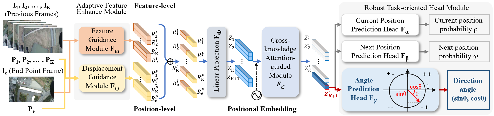

如需访问英文版本README.md, 
请点击 https://github.com/Katherine121/AngleRobust/blob/main/README_EN.md

# Angle Robust

Official implementation for paper 
[Angle Robustness Unmanned Aerial Vehicle Navigation in GNSS-Denied Scenarios](https://arxiv.org/abs/2402.02405)

Authors: Yuxin Wang, Zunlei Feng, Haofei Zhang, Yang Gao, Jie Lei, Li Sun, Mingli Song



<!-- 目录 -->

# :notebook_with_decorative_cover: 目录

- [背景](#star2-背景)
- [结构](#camera-结构)
- [技术栈](#space_invader-技术栈)
- [功能点](#dart-功能点)
- [安装](#toolbox-安装)
- [数据集](#bangbang-数据集)
- [训练](#gem-训练)
- [测试](#wave-测试)
- [引用](#handshake-引用)

<!-- 背景 -->
## :star2: 背景

针对极端条件下无人机无法获取GPS信号，无人机无法实现精确和稳健导航的问题，
提出了一种新的角度鲁棒导航范式来处理点对点导航任务中的飞行偏差。
另外，提出了一个新的视觉导航模型，包括自适应特征增强模块、
跨知识注意力引导模块和鲁棒任务导向头模块，以准确预测导航方向角。
为了评估基于视觉的导航方法，收集了一个新的数据集，称为UAV_AR368。
此外，使用谷歌地球设计了模拟飞行测试仪来模拟不同的飞行环境，从而减少了与实际飞行测试相关的费用。
所提出的方法在理想和干扰情况下实现了100.0%和67.5%的导航成功率，
比现有技术分别提高了26.0%和45.6%。

<!-- 结构 -->
## :camera: 结构

```
│  bs_train.py  
│  bs_train_one.py  
│  datasets.py  
│  main.py  
│  model.py  
│  README.md  
│  requirements.txt  
│  utils.py  
│  
├─baseline  
│  │  bs_datasets.py  
│  │  bs_models.py  
│  
└─processOrder  
   │  process_datasets.py  
   │  
   ├─100  
   │  │  cluster_centre.txt  
   │  │  cluster_labels.txt  
   │  │  cluster_pics.txt  
   │  │  
   │  ├─all_class  
   │  │  
   │  └─cluster_labels  
   │  
   ├─datasets  
   │  
   └─order
```

<!-- 技术栈 -->
### :space_invader: 技术栈

<ul>
  <li><a href="https://www.python.org/">Python</a></li>
  <li><a href="https://pytorch.org/">PyTorch</a></li>
  <li><a href="https://pypi.org/project/einops/">einops</a></li>
  <li><a href="https://matplotlib.org/">matplotlib</a></li>
  <li><a href="https://numpy.org/">numpy</a></li>
  <li><a href="https://pandas.pydata.org/">pandas</a></li>
  <li><a href="https://pypi.org/project/pillow/">pillow</a></li>
  <li><a href="https://scikit-learn.org/">scikit-learn</a></li>
  <li><a href="https://timm.fast.ai/">timm</a></li>

</ul>

<!-- 功能点 -->
### :dart: 功能点

- 无人机视觉导航

<!-- 安装 -->
## 	:toolbox: 安装

einops==0.6.0  
matplotlib==3.5.3  
numpy==1.21.5  
pandas==1.3.5  
Pillow==9.5.0  
scikit_learn==1.2.2  
timm==0.4.9  
torch==1.13.0  
torchvision==0.14.0

```bash
  git clone https://github.com/Katherine121/AngleRobust.git
  cd AngleRobust
```

<!-- 数据集 -->
### :bangbang: 数据集

如需访问我们的数据集UAV_AR368，请联系yuxinwang@zju.edu.cn。  
在这个数据集中，我们可以找到一个名为`order`的目录。  
在该目录中，有368个子目录，表示真实的无人机飞行路线。  
在每条路线中，从起点到终点都有不同数量的配有指定坐标的图像。  
要使用此数据集来训练我们的模型，您应该运行以下命令：  
```bash
mkdir processOrder
mv order processOrder/
cd processOrder
python process_datasets.py
```

<!-- 训练 -->
### :gem: 训练

```bash
  python main.py \
  --dist-url 'tcp://localhost:10001' \
  --multiprocessing-distributed --world-size 1 --rank 0
```

<!-- 测试 -->
### :wave: 测试

测试请访问[AngleRobustTest](https://github.com/Katherine121/AngleRobustTest)

<!-- 引用 -->
## :handshake: 引用

如果您认为这项工作对您的研究有用，请引用我们的论文：
```bash
@misc{wang2024angle,
      title={Angle Robustness Unmanned Aerial Vehicle Navigation in GNSS-Denied Scenarios}, 
      author={Yuxin Wang and Zunlei Feng and Haofei Zhang and Yang Gao and Jie Lei and Li Sun and Mingli Song},
      year={2024},
      eprint={2402.02405},
      archivePrefix={arXiv},
      primaryClass={cs.RO}
}
```
