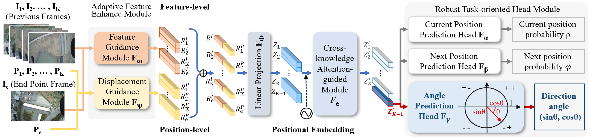

For Chinese README.md, you can click
https://github.com/Katherine121/AngleRobust/blob/main/README.md

# Angle Robust

Official implementation for paper 
[Angle Robustness Unmanned Aerial Vehicle Navigation in GNSS-Denied Scenarios](https://arxiv.org/abs/2402.02405)

Authors: Yuxin Wang, Zunlei Feng, Haofei Zhang, Yang Gao, Jie Lei, Li Sun, Mingli Song



<!-- Content -->

# :notebook_with_decorative_cover: Content

- [Background](#star2-Background)
- [Structure](#camera-Structure)
- [Technique Stack](#space_invader-Technique-Stack)
- [Features](#dart-Features)
- [Installation](#toolbox-Installation)
- [Dataset](#bangbang-Dataset)
- [Train](#gem-Train)
- [Test](#wave-Test)
- [Citation](#handshake-Citation)

<!-- Background -->
## :star2: Background

Due to the inability to receive signals from the Global Navigation Satellite System (GNSS) 
in extreme conditions, achieving accurate and robust navigation for Unmanned Aerial Vehicles (UAVs) 
is a challenging task. 
Recently emerged, vision-based navigation has been a promising and feasible alternative to 
GNSS-based navigation. However, existing vision-based techniques are inadequate in 
addressing flight deviation caused by environmental disturbances and 
inaccurate position predictions in practical settings. 
In this paper, we present a novel angle robustness navigation paradigm to 
deal with flight deviation in point-to-point navigation tasks. 
Additionally, we propose a model that includes the Adaptive Feature Enhance Module, 
Cross-knowledge Attention-guided Module and Robust Task-oriented Head Module to accurately 
predict direction angles for high-precision navigation. 
To evaluate the vision-based navigation methods, we collect a new dataset termed as UAV_AR368. 
Furthermore, we design the Simulation Flight Testing Instrument (SFTI) using Google Earth to 
simulate different flight environments, thereby reducing the expenses associated 
with real flight testing. Experiment results demonstrate that the proposed model outperforms 
the state-of-the-art by achieving improvements of 26.0% and 45.6% in the success rate of arrival 
under ideal and disturbed circumstances, respectively.

<!-- Structure -->
## :camera: Structure

```
│  bs_train.py  
│  bs_train_one.py  
│  datasets.py  
│  main.py  
│  model.py  
│  README.md  
│  requirements.txt  
│  utils.py  
│  
├─baseline  
│  │  bs_datasets.py  
│  │  bs_models.py  
│  
└─processOrder  
   │  process_datasets.py  
   │  
   ├─100  
   │  │  cluster_centre.txt  
   │  │  cluster_labels.txt  
   │  │  cluster_pics.txt  
   │  │  
   │  ├─all_class  
   │  │  
   │  └─cluster_labels  
   │  
   ├─datasets  
   │  
   └─order
```

<!-- Technique Stack -->
### :space_invader: Technique Stack

<ul>
  <li><a href="https://www.python.org/">Python</a></li>
  <li><a href="https://pytorch.org/">PyTorch</a></li>
  <li><a href="https://pypi.org/project/einops/">einops</a></li>
  <li><a href="https://matplotlib.org/">matplotlib</a></li>
  <li><a href="https://numpy.org/">numpy</a></li>
  <li><a href="https://pandas.pydata.org/">pandas</a></li>
  <li><a href="https://pypi.org/project/pillow/">pillow</a></li>
  <li><a href="https://scikit-learn.org/">scikit-learn</a></li>
  <li><a href="https://timm.fast.ai/">timm</a></li>

</ul>

<!-- Features -->
### :dart: Features

- Unmanned Aerial Vehicle visual navigation

<!-- Installation -->
## 	:toolbox: Installation

einops==0.6.0  
matplotlib==3.5.3  
numpy==1.21.5  
pandas==1.3.5  
Pillow==9.5.0  
scikit_learn==1.2.2  
timm==0.4.9  
torch==1.13.0  
torchvision==0.14.0

```bash
  git clone https://github.com/Katherine121/AngleRobust.git
  cd AngleRobust
```

<!-- Dataset -->
### :bangbang: Dataset

If you need to access our dataset UAV-AR368, please contact yuxinwang@zju.edu.cn.  
In this dataset, we can find a directory called "order".  
In this directory, there are 368 subdirectories representing the actual drone flight routes.  
In each route, there are different numbers of images with specified coordinates 
from the starting point to the endpoint.  
To use this dataset to train/test our model, you should run the following command:  
```bash
mkdir processOrder
mv order processOrder/
cd processOrder
python process_datasets.py
```

<!-- Train -->
### :gem: Train

```bash
  python main.py \
  --dist-url 'tcp://localhost:10001' \
  --multiprocessing-distributed --world-size 1 --rank 0
```

<!-- Test -->
### :wave: Test

For testing, please refer to: [AngleRobustTest](https://github.com/Katherine121/AngleRobustTest)

<!-- Citation -->
## :handshake: Citation

If you found this work useful for your research, please cite our paper:  
```bash
@misc{wang2024angle,
      title={Angle Robustness Unmanned Aerial Vehicle Navigation in GNSS-Denied Scenarios}, 
      author={Yuxin Wang and Zunlei Feng and Haofei Zhang and Yang Gao and Jie Lei and Li Sun and Mingli Song},
      year={2024},
      eprint={2402.02405},
      archivePrefix={arXiv},
      primaryClass={cs.RO}
}
```
